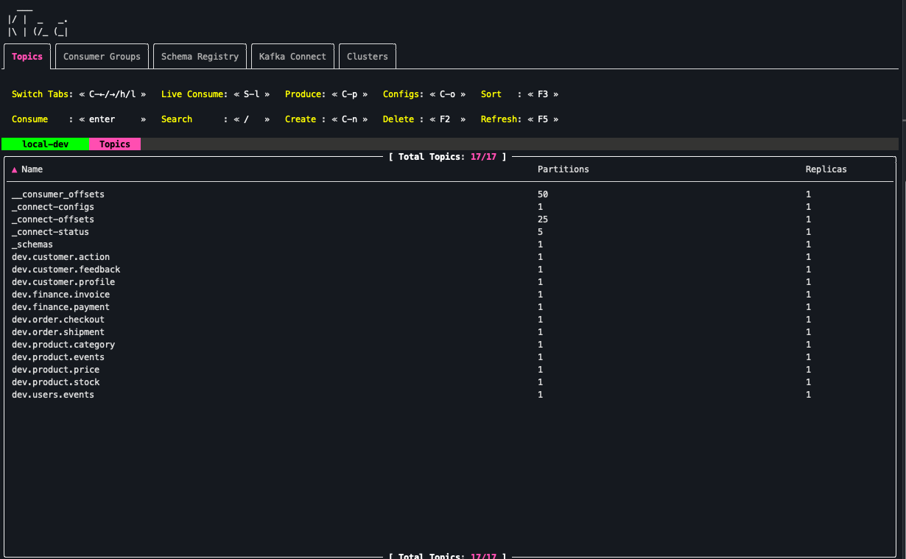
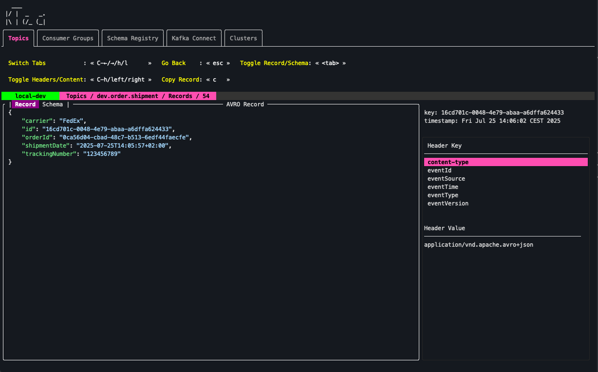
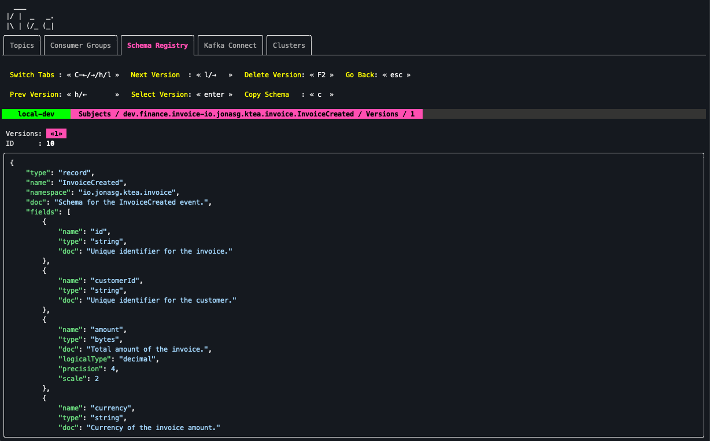

<p>
  <a href="https://github.com/jonas-grgt/ktea/releases"></a>
  <a href="https://github.com/jonas-grgt/ktea/actions"></a>
</p>

# 🫖 ktea - kafka terminal client

ktea is a tool designed to simplify and accelerate interactions with Kafka clusters.





## Installation

### Mac

```sh
brew tap jonas-grgt/ktea
brew install ktea
```

### Linux

Binaries available at the release page.

### Windows

Binaries available at the release page.

## Usage

### Configuration

All configuration is stored in `~/.config/ktea/config.conf`

### Cluster Management

Multiple clusters can be added.
Upon startup when no cluster is configured you will be prompted
to add one.

#### Supported Auth Methods

- No Auth
- SASL (SSL)
    - PLAIN

## Features

- *Multi-Cluster Support*: Seamlessly connect to multiple Kafka clusters and switch between them with ease.
- *Topic Management*: List, create, delete, and modify topics, including partition and offset details.
- *Record Consumption*: Consume records in text, JSON, and **Avro** formats, with powerful search capabilities.
- *Consumer Group Insights*: Monitor consumer groups, view their members, and track offsets.
- *Schema Registry Integration*: Browse, view, and register schemas effortlessly.

## Todo

- Add more authentication methods
- Add support for more message formats such as protobuf.
- Add ACL management.
- File based import/export of topics.
- Add ability to delete specific schema versions.
- Add consumption templating support.
- Many more, just file an issue requesting a feature!

## Development

### Dev cluster setup

A docker-compose setup is provided to quickly spin up a local Kafka cluster with pre-created topics, consumer groups,
commited offsets etc ...

```sh
cd docker
docker-compose up -d
```

### Generate data

After the local cluster is up and running, you can generate some data to work with, 
using`go run -tags prd ./cmd/generate`.

### Run `ktea`

Use `go run -tags dev cmd/ktea/main.go` to run `ktea` from the root of the repository.

> Note: running the tui with dev build tag will simulate an artificial slow network by sleeping for 2 seconds when doing network IO. This way the loaders and spinners can be visually asserted.
